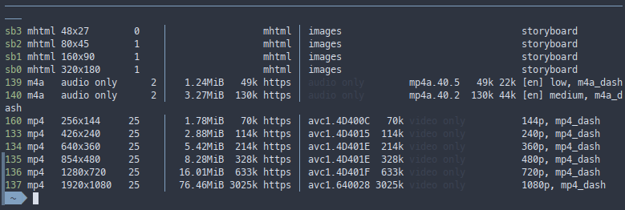

# yt-dlp

yt-dlp - консольная утилита с открытым исходным кодом для скачивания видео с различных видеохостингов

::: code-group
```shell [apt-get]
su -
apt-get install yt-dlp
```

```shell [epm]
epm -i yt-dlp

```
:::

## Функции утилиты

### Скачивание видео

Чтобы скачать видео с YouTube или другого поддерживаемого сайта, просто укажите URL:

```shell
yt-dlp "https://www.youtube.com/watch?v=dQw4w9WgXcQ"
```
### Выводим список форматов видео и его разрешений

```shell
yt-dlp -F "https://www.youtube.com/watch?v=dQw4w9WgXcQ"
```



### Скачиваем видео в формате FullHD и с максимальным качеством звука

Если вы хотите скачать видео с определённым качеством, вы можете использовать опцию -f (или --format):

```shell
yt-dlp -f 614+140 "https://www.youtube.com/watch?v=dQw4w9WgXcQ"
```
### Загрузка аудио

Если вам нужно скачать только аудиотрек, вы можете использовать параметр -x (или --extract-audio):

```shell
yt-dlp -x --audio-format mp3 https://www.youtube.com/watch?v=dQw4w9WgXcQ
```
### Скачивание плейлиста

Чтобы скачать все видео из плейлиста, просто укажите URL плейлиста:

```shell
yt-dlp "https://www.youtube.com/playlist?list=PLZNYHOUKqoWMpfeE9PUVogAFrXOQxhzUB"
```
### Скачивание субтитров

Если видео содержит субтитры, вы можете скачать их с помощью следующей команды:
```shell
yt-dlp --write-subs --sub-lang "https://www.youtube.com/watch?v=HSx36bMDg80&t=395s"
```
